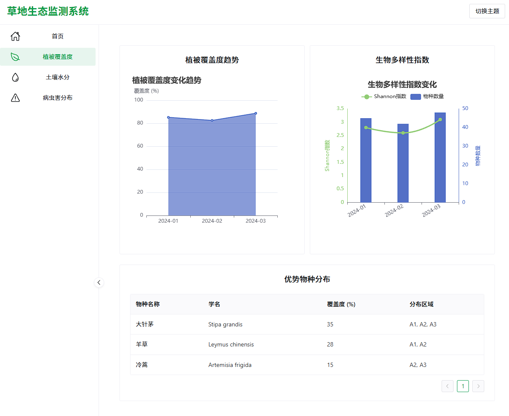
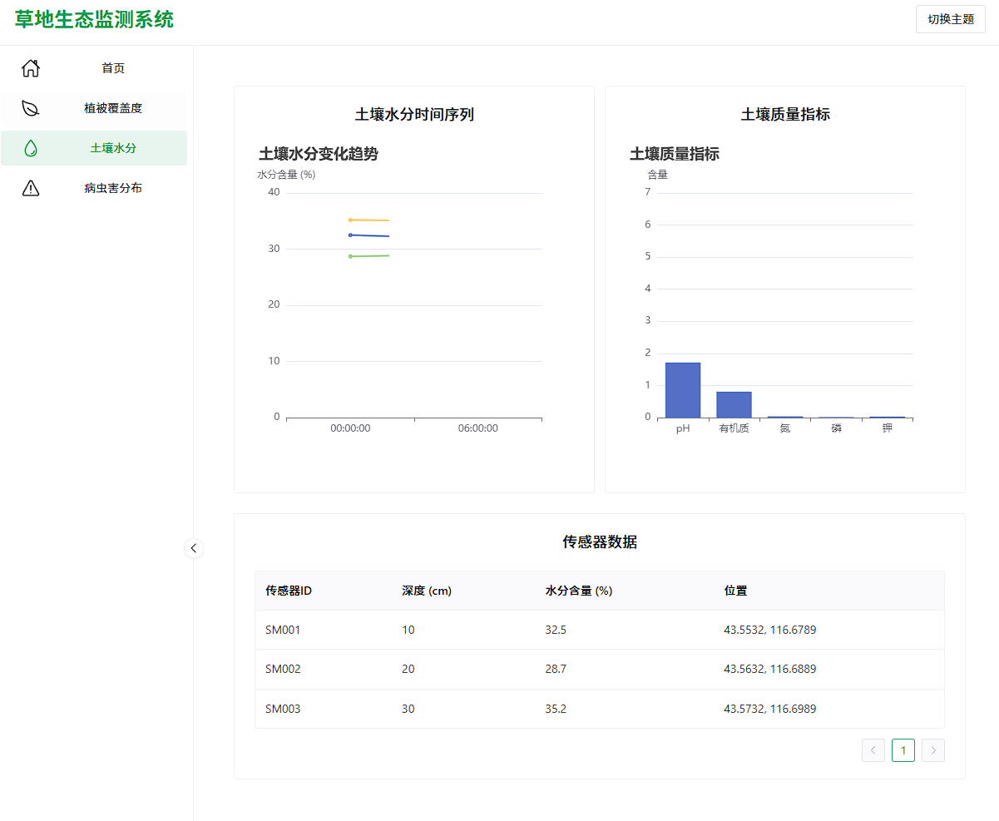
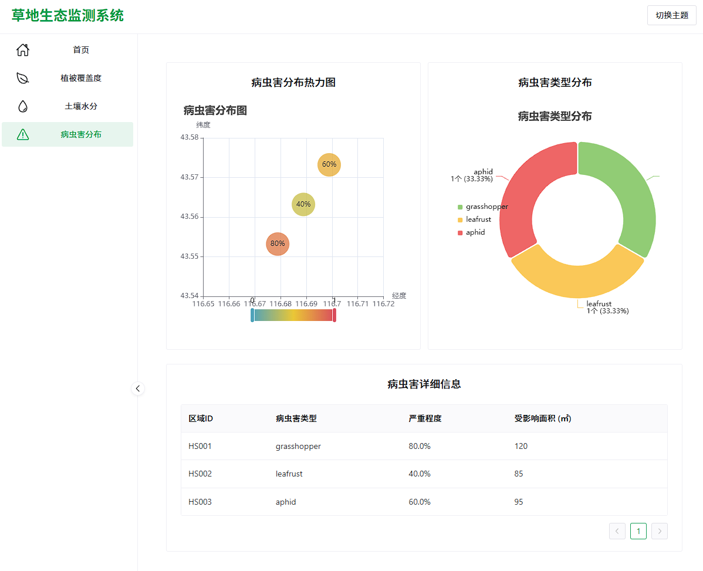

# 草地生态监测系统 🌿

一个基于 Vue 3 + TypeScript + Vite + ECharts 的草地生态监测可视化系统。

项目截屏 📷





## 功能特点 ✨

- 📊 植被覆盖度趋势分析
- 🌱 生物多样性指数监测
- 🐛 病虫害分布可视化
- 💧 土壤水分监测
- 📱 响应式设计，支持多设备访问

## 环境要求 🛠️

- Node.js >= 16.0.0
- npm >= 8.0.0
- Vue.js 3.x
- TypeScript 5.x
- Vite 6.x

## 安装步骤 📥

1. 克隆项目
```bash
git clone https://github.com/MilesSG/GrassMonitor.git
cd grassmonitor
```

2. 安装依赖
```bash
npm install
```

3. 启动开发服务器
```bash
npm run dev
```

4. 构建生产版本
```bash
npm run build
```

## 项目依赖 📦

- [Vue 3](https://vuejs.org/) - 渐进式 JavaScript 框架
- [Vite](https://vitejs.dev/) - 下一代前端构建工具
- [TypeScript](https://www.typescriptlang.org/) - JavaScript 的超集
- [ECharts](https://echarts.apache.org/) - 强大的数据可视化库
- [Naive UI](https://www.naiveui.com/) - Vue 3 组件库

## 项目结构 📁

```
grassmonitor/
├── src/
│   ├── assets/        # 静态资源
│   ├── components/    # 公共组件
│   ├── data/         # 模拟数据
│   ├── router/       # 路由配置
│   ├── views/        # 页面组件
│   ├── App.vue       # 根组件
│   └── main.ts       # 入口文件
├── public/           # 公共资源
├── index.html        # HTML 模板
├── package.json      # 项目配置
├── tsconfig.json     # TypeScript 配置
└── vite.config.ts    # Vite 配置
```

## 开发指南 💻

### 开发环境设置

1. 安装 [Node.js](https://nodejs.org/) (推荐使用 nvm 管理 Node.js 版本)
2. 安装 [Visual Studio Code](https://code.visualstudio.com/)
3. 安装推荐的 VS Code 插件：
   - Vue Language Features (Volar)
   - TypeScript Vue Plugin (Volar)
   - ESLint
   - Prettier

### 代码规范

- 使用 TypeScript 编写代码
- 遵循 Vue 3 组合式 API 风格
- 使用 ESLint 和 Prettier 进行代码格式化

## 浏览器支持 🌐

- Chrome >= 87
- Firefox >= 78
- Safari >= 14
- Edge >= 88

## 贡献指南 🤝

1. Fork 项目
2. 创建特性分支 (`git checkout -b feature/AmazingFeature`)
3. 提交更改 (`git commit -m 'Add some AmazingFeature'`)
4. 推送到分支 (`git push origin feature/AmazingFeature`)
5. 创建 Pull Request

## 许可证 📄

[MIT License](LICENSE)


## 致谢 🙏

感谢所有为本项目做出贡献的开发者！
